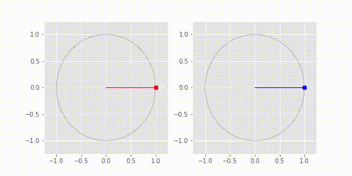

## KuraNet: A fully differentiable Kuramoto model for understanding disordered oscillator networks

This repository contains the code for a fully-differentiable [Kuramoto model](https://en.wikipedia.org/wiki/Kuramoto_model "Kuramoto model") in the form of "KuraNet". KuraNet, based on reference [1], is used for understanding the relationship between disordered node features and dynamical behavior by modeling this relationship as a differentiable, parametrized function. This function is a deep neural network trained by gradient descent using [torchdiffeq](https://www.github.com/rtqichen/torchdiffeq "torchdiffeq") [2].

## Requirements and installation

All code is written in Pytorch 1.4.0. using Python 3.5.2. After cloning this repository, run

`pip install -r requirements.txt`

to install all necessary requirements (besides Python and CUDA backend). Note that current versions of pip do not work with Python 3.5. If you encounter any installation problems, consider using pip version 20.4.3. 

## Examples

Demos for three experiments are contained in the notebooks `global.ipynb`, `cluster.ipynb` and `images.ipynb`. For example, here is (top) KuraNet learning to synchronize oscillators on a sparse graph (optimized left, control right) and (bottom) an image of an elk that KuraNet has learned to synchronize:

## Basic Usage

We consider a general Kuramoto model of the form 

where `K` is a coupling matrix and`I` is a random sample of intrinsic oscillator features comprising natural frequencies, external field strengths and transmission delays. Suppose a particular dynamical state (e.g. global synchrony; `theta_i ~= theta_j` for all `ij`) minimizes the loss function `L`. The goal of KuraNet is to model the differentiable function `I --> K` as a neural network so that `L` is minimized on average over realizations of `I`. KuraNet is built to model the relationship between disordered node features and couplings which gives rise to collective oscillator behavior. 

To train a single model, first edit the config file `experiments.cfg` according to the experiment you'd like to run (for explanation of config fields, see below). Please be sure to change the file paths to suit your environment. This config file also contains several default experiments. Next, call

`python run.py --experiments <EXP_NAME1> <EXP_NAME2> ... <EXP_NAMEn> --num_seeds <n> --device <device>` 

in terminal, where `<EXP_NAMEi>` is the config file heading corresponding to the experiment i,`<n>` is the number of seeds you would like to run, and <device> is either `cpu` or `gpu`. (CPU usage is slow, so GPU is recommended). To also generate the data for the experiments you'd like to run, use the shell argument `--generate_data True`. In the case of a running a single experiment, you can also simply call `python train.py --NAME <EXP_NAME> --num_seeds <n>`.

### Experiment configuration

Details for each field in `experiments.cfg ` can be found in the [extended README](./extended_README.md). 

### References

[1]  Ricci, M., Jung, M., Zhang, Y., Chalvidal, M., Soni, A., & Serre, T. (2021). KuraNet: Systems of Coupled Oscillators that Learn to Synchronize, 1–9. Retrieved from http://arxiv.org/abs/2105.02838

[2]  Chen, R. T. Q., Rubanova, Y., Bettencourt, J., & Duvenaud, D. (2018). Neural Ordinary Differential Equations. In 32nd Conference on Neural Information Processing Systems (NeurIPS 2018). Montréal, Canada: Curran Associates. https://doi.org/10.1007/978-3-662-55774-7_3
